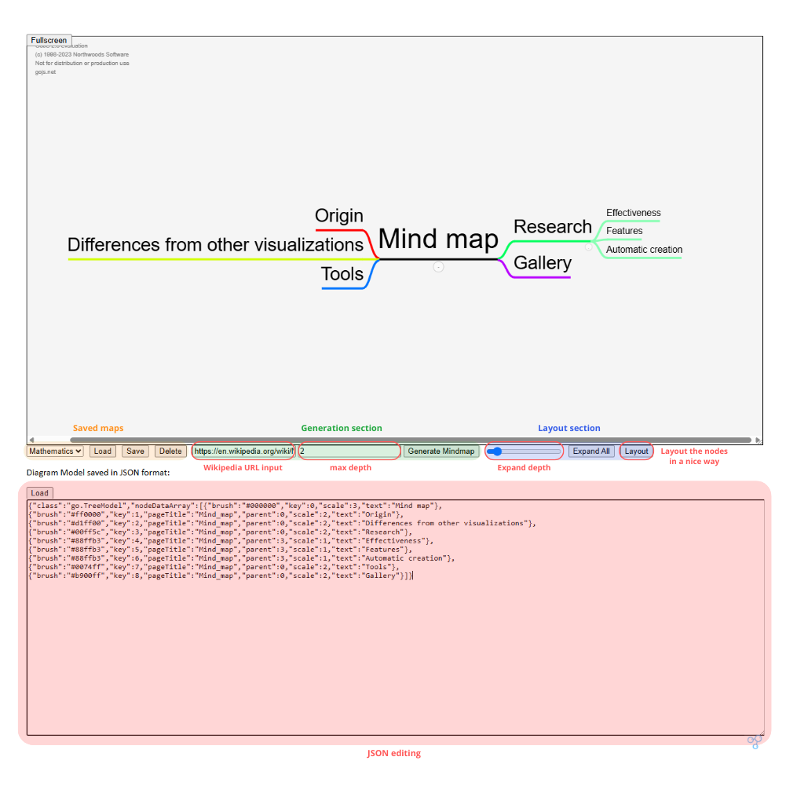
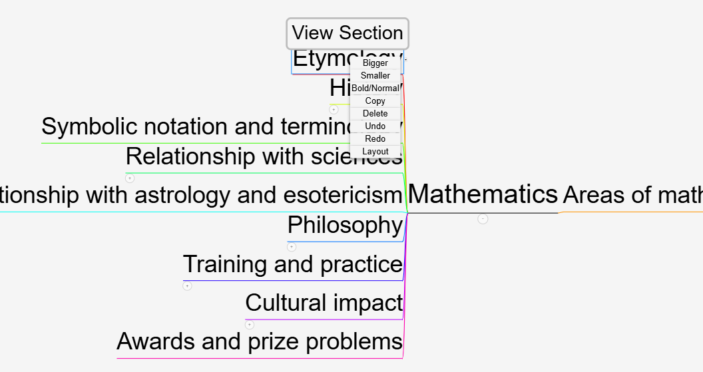

# Mindmap Generator

**Mindmap Generator** is a web-based tool that extracts Wikipedia content and converts it into interactive mind maps. This project uses **Flask** for the backend and **GoJS** for the frontend visualization.

---

## Features
- **Generate mind maps** from Wikipedia articles.
- **Customize layouts** by expanding, collapsing, and editing nodes.
- **Save and load mind maps** in JSON format.
- **Interactive UI** with zoom, context menus, and node manipulation.

---

## Installation
### **Clone the Repository**
```sh
git clone https://github.com/mathieu-portfolio/Mindmap-Generator.git
cd Mindmap-Generator
```

### **Install Dependencies**
```sh
pip install -r requirements.txt
```

---

## **Usage**
### **Run the Application**
```sh
python flask_app.py
```
Then open **`http://localhost:5000/`** in your browser (Google Chrome is recommended for GoJs).



### **Generating a Mind Map**
1. Enter a **Wikipedia URL** and **max depth**, which is the maximum number of children the main node can have.
2. Click **"Generate Mindmap"**.

### **Editing a Mind Map**
- **Right-click a node** for options (resize, delete, bold, etc.).
- **Drag nodes** to rearrange.
- Don't forget to **Save** your mind map!

### **Exploring a Mind Map**
- **Load** or **Generate** your mind map.
- **Expand or collapse sections** with the + or - sign underneath.
- Click on **"View Section"** to open the corresponding Wikipedia page.



---

## **Generating Documentation (Doxygen)**
To generate the **Doxygen documentation** for Python & JavaScript files:

### **Install Doxygen**
- **Linux/macOS**:  
  ```sh
  sudo apt install doxygen  # Ubuntu/Debian
  brew install doxygen      # macOS
  ```
- **Windows**: Download from [doxygen.nl](https://www.doxygen.nl/download.html) and install it.

### **Run Doxygen**
```sh
doxygen Doxyfile
```
This will generate the documentation in:
```
docs/doxygen/html/index.html
```
Open this file in a web browser to view the documentation.
